# Results of Testing

The test results show the actual outcome of the testing, following the [Test Plan](test-plan.md)

---

## Test the lanes work

testing if the lanes choices the player chooses are kept. And that the correct unit is placed in the lane along with displaying the choice for the lanes.

### Test Data Used

The test data used is from 2 list being modified based on the input of the user in the case of this test is the player1Units list which is the available units that player 1 can use and 
the player1Lane1 list which contains the unit choice for the lane.

### Test Result

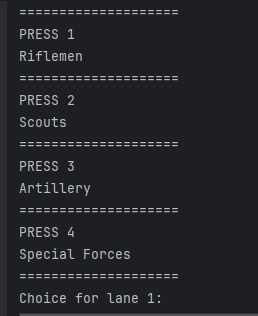

the image above shows the information the user is shown to prompt them to enter a number corresponding to a unit choice for the lane.

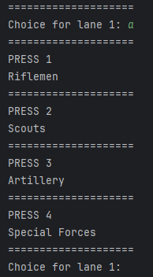

If you enter an incorrect value eg: a letter in the example above "a". the program will ask you what you want to put in lane 1 again.

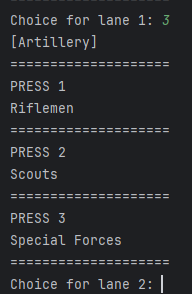

once a correct input is entered, In this case 3 the unit that corresponded to that is added to the lane 1 list which is printed to show that it is working properly.

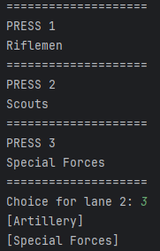

Lane 2 (above) also works

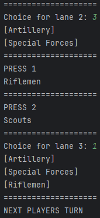

Lane 3 (above) works as well
after which as all of player 1's lanes have been selected it becomes player 2's turn as you can see at the bottom of the screenshot above.

---

## Test the units work properly

This test will test if units act as expected eg: when a unit is compared to another unit the correct conclusion is come to by the program such as Riflemen when compared to artillery will lose
resulting in a win for whomever played the artillery in that lane. I also want to test that after each round the amount of units is expected and there are no duplicates in the available units list.

### Test Data Used

this test will focus on the player1Units list and the player2Units list which both contain the available units that each player can use and which change as the game continues.

### Test Result

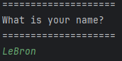

(above the naming of player 1 which happened before any lane unit choosing)

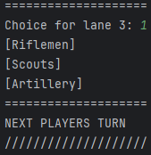

In the lane unit choosing above I choose [Riflemen],[Scouts] and [Artillery] for player 1 (named LeBron)

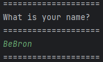

(above the naming of player 2 which happened before any lane unit choosing by player 2)

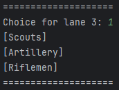

In the lane unit choosing above I choose [Scouts],[Artillery] and [Riflemen] for player 1 (named BeBron)

after both players have made their lane unit choices the program checks to see who wins comparing
both players lane unit choices to each other.
In this case player 1 (LeBron) should win as their lane 1 choice of [Riflemen] beats player 2's (BeBron's)
choice of [Scouts], And player 1 should also win lane 2 as [Scouts] beat [Artillery] but player should also win
lane 3 as [Artillery] beats [Riflemen]. This means the program should return a round win for player 1 (LeBron)
and move the round to the fallback of player 2 (BeBron) as this was the first round.

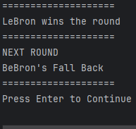

Which the program does as you can see above.

### Bug found in code dealing with units

While testing using special forces I found a bug where because there is a unit left over as there is 4 options of units
and every round you are given the 3 starting units ([Riflemen], [Scouts] and [Artillery]) If one of these units
was not chosen in the round and rather special forces were then it would result in that spare unit being available twice in the
next round (as you can see below)

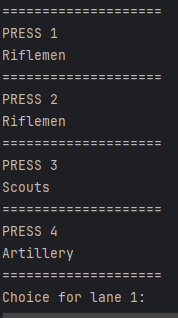

with a duplicate of [Riflemen] being produced in this example above.

To solve this bug I need to change the program so that it will reset the available units list every round (those list being
player1Units for player 1 and player2Units for player 2)

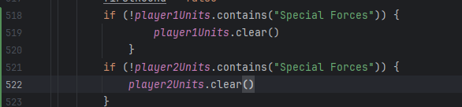

I solved this bug by adding the code above which checks if the units list of the player contains Special Forces
and if it does not clear the list which will get rid of the leftover unit from the last round stopping it from carrying over to the next.
thus solving the bug.

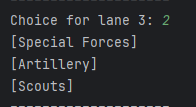

The image above showing Special Forces being chosen leaving a unit in the player1Units list.

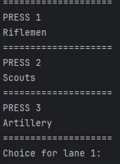

which is not carried into the next round as you can see above

### Bug found in code dealing with rounds

when a player wins it still displays next round which there will not be as the game is finished after a player loses their last stand round.
it also incorrectly displays the next round as last stand when the round that just happened was a last stand round.

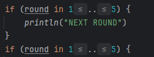

To fix this problem I added the code above which checks if the round is between 1-5 (meaning there would be a next round)
and it was not then it will not run.

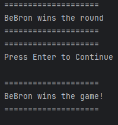

The result of which you can see above where it no longer displays the next round text or the incorrect round that would be next.

---

